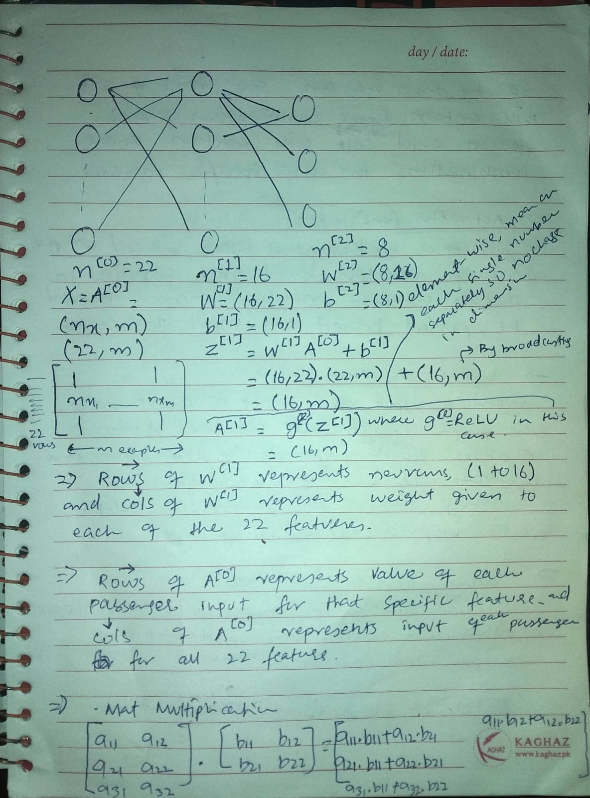
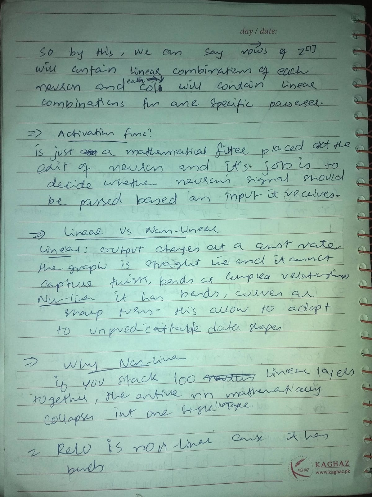
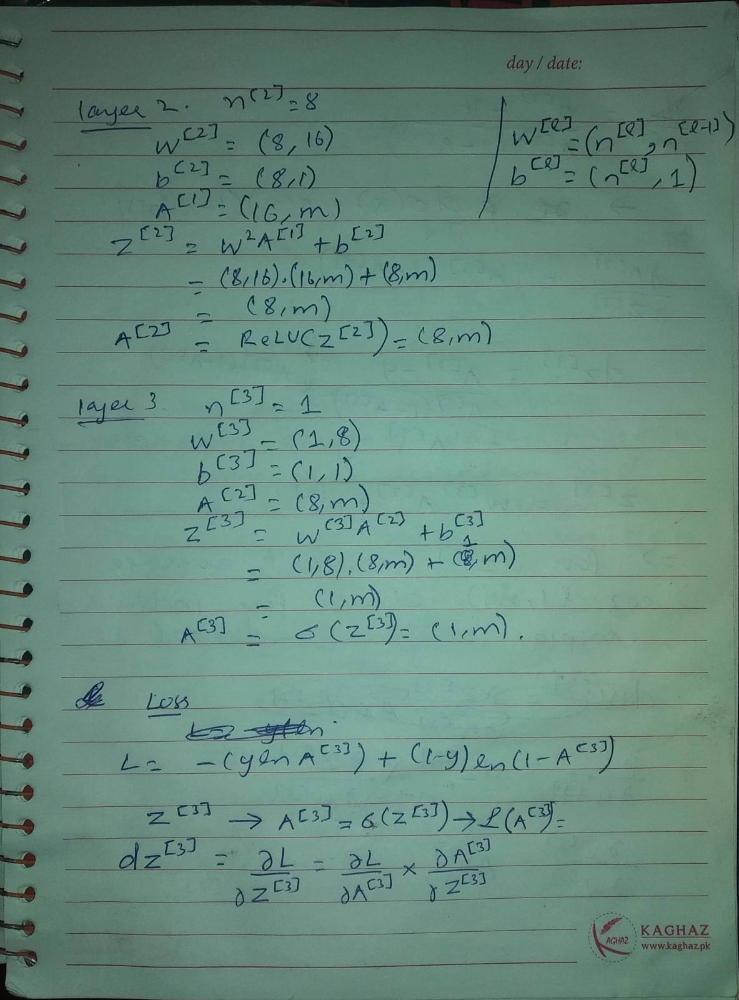
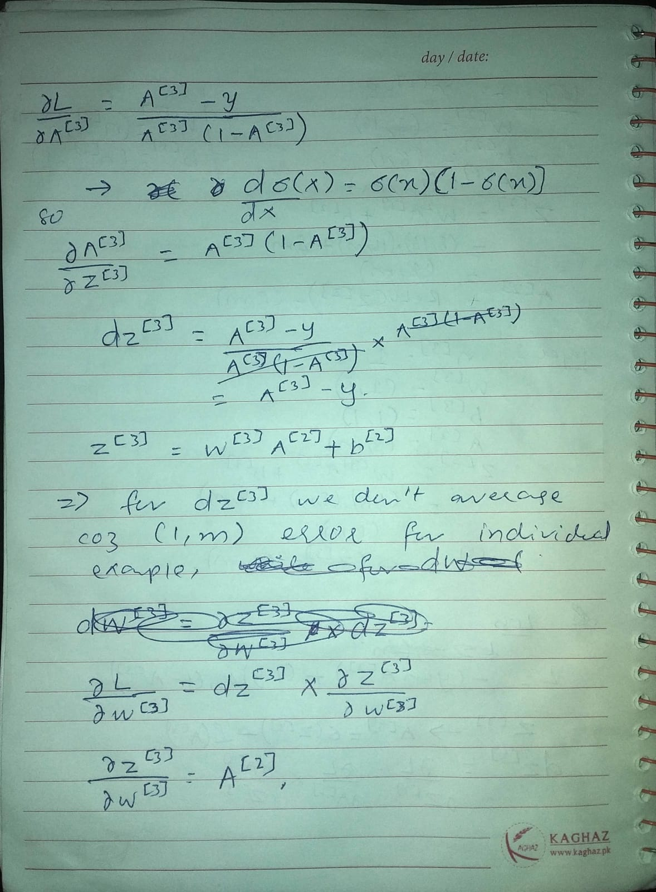
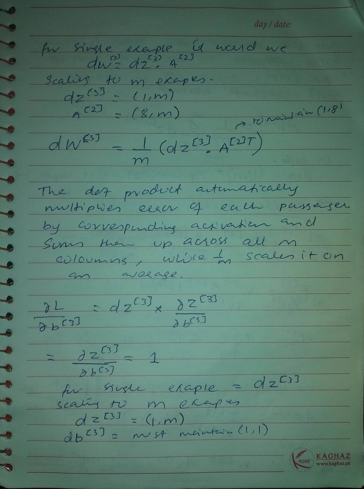
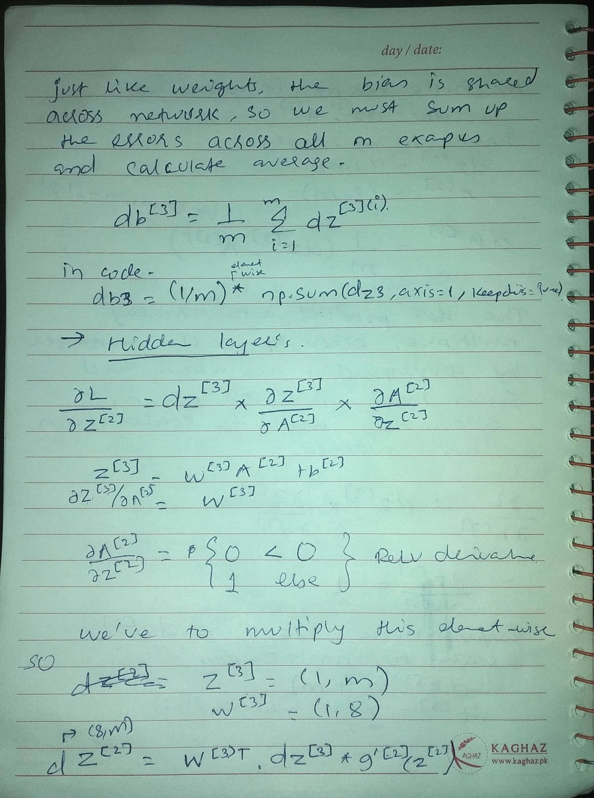
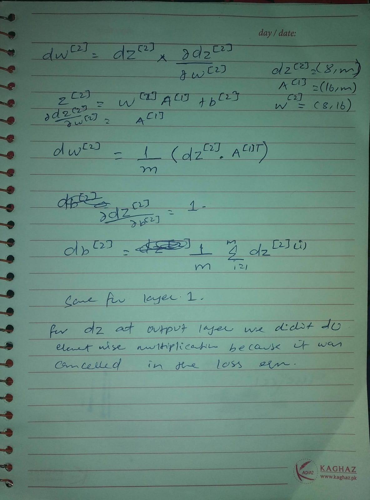
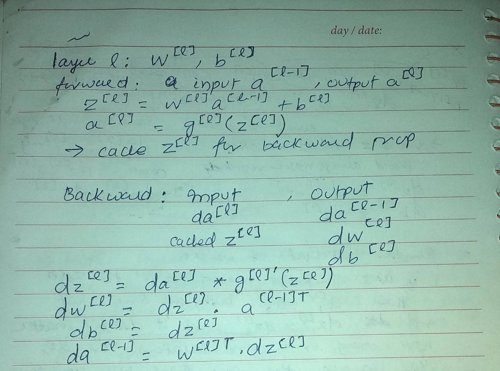

## Airline Passenger Satisfaction Predictor: From Scratch to PyTorch

### Problem Statement

This project addresses a binary classification problem: predicting whether a passenger walked off their flight **satisfied** or **dissatisfied** based on a dataset of over 130,000 passenger records. The data includes 22 features capturing demographic information (age, customer loyalty), flight details (distance, delays), and specific service ratings (seat comfort, cleanliness, on-board service).

---

### The Solution

This repository tracks a ground-up development process designed to master neural network mechanics before abstracting them into a framework.

1. **Data Preprocessing & Engineering:** Cleaned missing entries, converted multi-class categorical features (like flight class) into binary dummy columns, and normalized wide-scale numerical features (like flight distance) using Z-score standardization.
2. **Phase 1: Pure Mathematical Implementation (NumPy):** Designed a 3-layer deep neural network architecture from scratch ($22 \rightarrow 16 \rightarrow 8 \rightarrow 1$).
* Manually derived and coded the full forward pass using **ReLU** and **Sigmoid** activation functions.
* Hand-calculated the vectorized backpropagation equations using the calculus chain rule.
* *Achieved an accuracy of **83.39%** on the unseen test set using pure matrix math.*

3. **Phase 2: Framework Modernization (PyTorch):**
* Translated the verified manual architecture into a modular object-oriented PyTorch pipeline (`nn.Module`).
* Integrated high-performance data pipelines via `TensorDataset` and mini-batch `DataLoader` streams to transition from full-batch gradient descent to Stochastic Gradient Descent (SGD).

---

### Mathematical Derivations & Notes

<table>
  <tr>
    <td></td>
    <td></td>
  </tr>
  <tr>
    <td></td>
    <td></td>
  </tr>
  <tr>
    <td></td>
    <td></td>
  </tr>
  <tr>
    <td></td>
    <td></td>
  </tr>
</table>